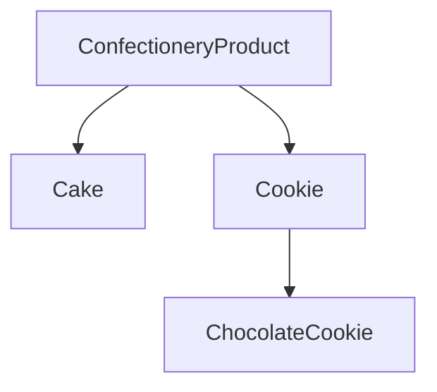
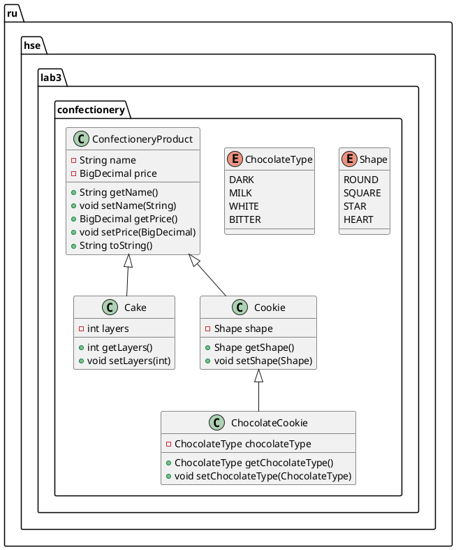
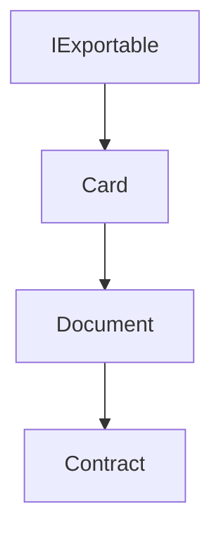
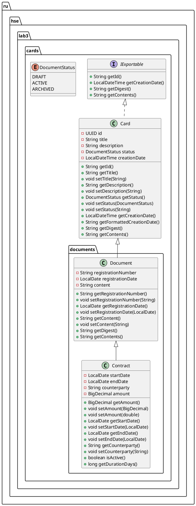

## Lab 3

Work №3 for java course in HSE

Variant 15

## UML Class Diagrams

The diagrams below describe the main class hierarchies in the project.

### Confectionery model

### Card/document model

